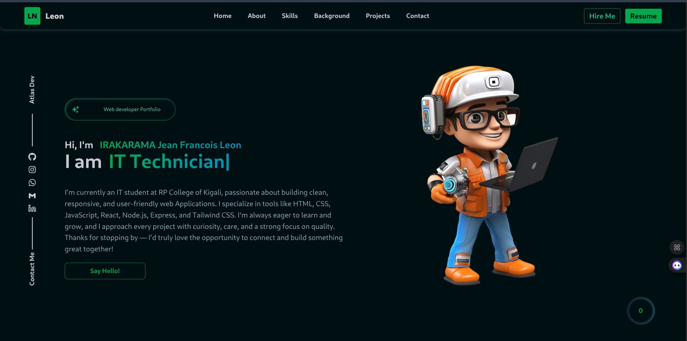
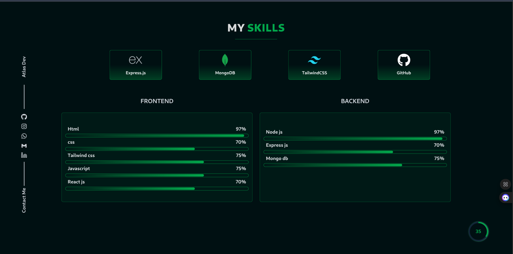
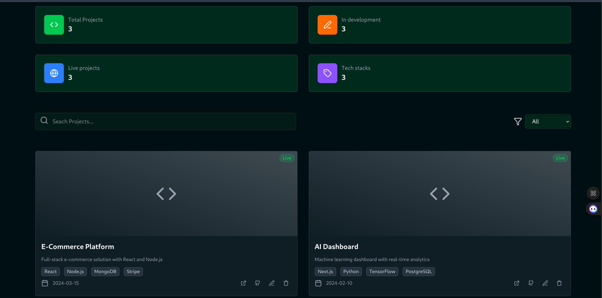

# Web Developer Portfolio

A full-stack portfolio application showcasing my work, featuring a **public portfolio site** and a **secure admin dashboard** to manage projects.  

This project demonstrates my ability to build responsive, interactive, and maintainable web applications with modern development practices.

---

## ✨ Key Features

### Public Portfolio
- Responsive, modern interface  
- Highlights projects, skills, and experience  
- Contact form integration  

### Admin Dashboard
- Secure login for project management  
- Add, edit, or remove projects dynamically  

---

## 🛠️ Tech Stack (Highlighted)

**Frontend:** React, Tailwind CSS, and modern UI animation libraries.  
**Backend:** Node.js, Express, and MongoDB for API and data management.  

> *Note: Additional tools and libraries are used internally for performance, animation, and interactivity.*

---

## 📸 Screenshots

### Portfolio Website


### Skills page


### Admin Dashboard



*(Place screenshots in `/screenshots` folder in your repo.)*

---

## 🚀 Installation & Setup

Clone the repo and run locally:

```bash
git clone https://github.com/vicious-franco/portfolio.git
cd portfolio

# Frontend
cd client
npm install
npm start

# Backend
cd ../server
npm install
npm run dev
